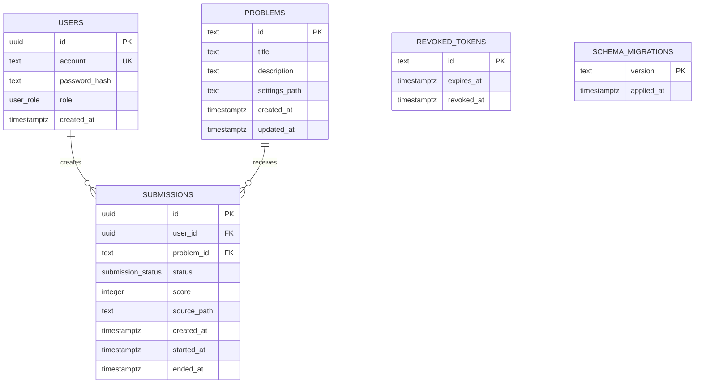

# REGS ERD

```mermaid
erDiagram
    USERS ||--o{ SUBMISSIONS : creates
    PROBLEMS ||--o{ SUBMISSIONS : receives

    USERS {
        uuid id PK
        text account UK
        text password_hash
        user_role role
        timestamptz created_at
    }

    PROBLEMS {
        text id PK
        text title
        text description
        text settings_path
        timestamptz created_at
        timestamptz updated_at
    }

    SUBMISSIONS {
        uuid id PK
        uuid user_id FK
        text problem_id FK
        submission_status status
        integer score
        text source_path
        timestamptz created_at
        timestamptz started_at
        timestamptz ended_at
    }

    REVOKED_TOKENS {
        text id PK
        timestamptz expires_at
        timestamptz revoked_at
    }

    SCHEMA_MIGRATIONS {
        text version PK
        timestamptz applied_at
    }
```

`revoked_tokens` 保存已登出的 JWT ID，因此登出後 token 即使尚未過期也不能再使用。`schema_migrations` 是啟動時 migration runner 的版本紀錄。題目 ZIP、submission source 與 log 本體保存在檔案系統，資料庫只保存識別資料及路徑。
